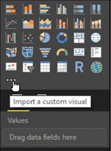
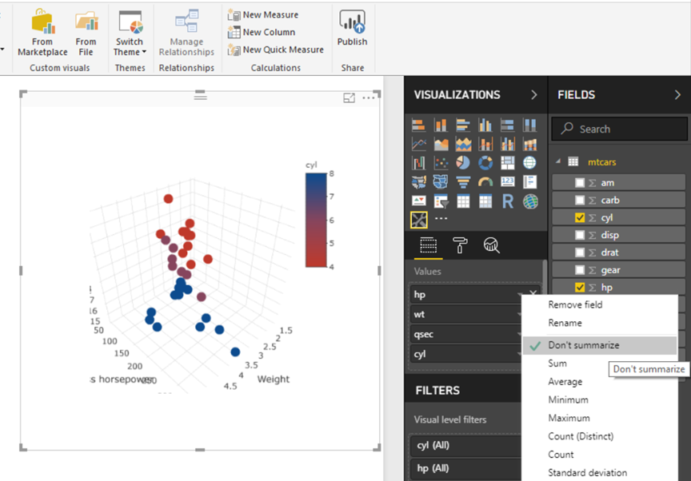

# PowerBI-3Dscatter
PowerBI custom visual to display a 3D scatter using the R package `plotly` (<https://github.com/plotly>, <https://plot.ly/>).

## Introduction

This visual and walkthrough is based on [this RPubs article by John Friel](https://rpubs.com/jpf5046/313759). 

These are the basic steps to follow:

1. If not already done, download and install node.js from here <https://nodejs.org/en/>,
2. Initialize a custom visual package using command line tools,
3. Edit the R code that comes with the package,
4. Complie the visual using command line tools again,
5. Import the custom visual into PowerBI.

## 1. Installing node.js
If not previously installed, Node.js can be downloaded here: <https://nodejs.org/en/>

Follow the instructions to install Node.js for your system.

## 2. Initialize custom visual

Open a console window / command line tool (e.g. PowerShell or Command prompt) and navigate to the base directory whereunder you want to save your custom visual files.

To initialize a new custom visual type the following:

```ShellSession
> pbiviz new pbi3Dscatter -t rhtml
> cd powerBI-3Dscatter
> npm i powerbi-visuals-utils-dataviewutils
> pbiviz start
```

When there are no errors you can hit Ctrl+C to stop the process. But don't close the console window yet.

> Note: Use only characters and numbers in your package name since special characters (even '-') can throw errors when `pbiviz start` is executed.


## 3. Edit the R code
Now we need to edit the R code script `script.r` that comes with the visual package. It  can be found in the base directory of the package, here: `pbi3Dscatter/`

The initial `script.r` should look something like this:

```R
source('./r_files/flatten_HTML.r')

############### Library Declarations ###############
libraryRequireInstall("ggplot2");
libraryRequireInstall("plotly")
####################################################

################### Actual code ####################
g = qplot(`Petal.Length`, data = iris, fill = `Species`, main = Sys.time());
####################################################

############# Create and save widget ###############
p = ggplotly(g);
internalSaveWidget(p, 'out.html');
####################################################
```

Change the code to look like below and save your changes. You could also download the `script.r` file in the base map of this repository and replace the respective file in your package folder.

```R
source('./r_files/flatten_HTML.r')

############### Library Declarations ###############
libraryRequireInstall("ggplot2");
libraryRequireInstall("plotly");
libraryRequireInstall("dplyr");
####################################################

################### Actual code ####################
#g = qplot(`Petal.Length`, data = iris, fill = `Species`, main = Sys.time());

p <- Values %>%
        plot_ly( x = ~wt, y = ~hp, z = ~qsec, color = ~cyl, colors = c('#BF382A', '#0C4B8E')) %>%
        add_markers() %>%
        layout(scene = list(xaxis = list(title = 'Weight'),
                            yaxis = list(title = 'Gross horsepower'),
                            zaxis = list(title = '1/4 mile time')));
####################################################

############# Create and save widget ###############
#p = ggplotly(g);
internalSaveWidget(p, 'out.html');
####################################################
```

## 4. Package and import
Go back to the console and type:
```ShellSession
> pbiviz package
```

This will create a new sub folder `dist` in the package base folder.
This folder should keep a file `pbi3Dscatter.pbiviz`.

In PowerBI you can now load this visual:



In our example script the value names are hardcoded ```x = ~wt, y = ~hp, z = ~qsec, color = ~cyl```.
Therefore the variables that are added to the values field of the visual need to have the exact names.

If you get only one point in your visual, then check if your variable values are not summarized, e.g. as _Sum_ or _Average_.

The result should look like in the picture below:


